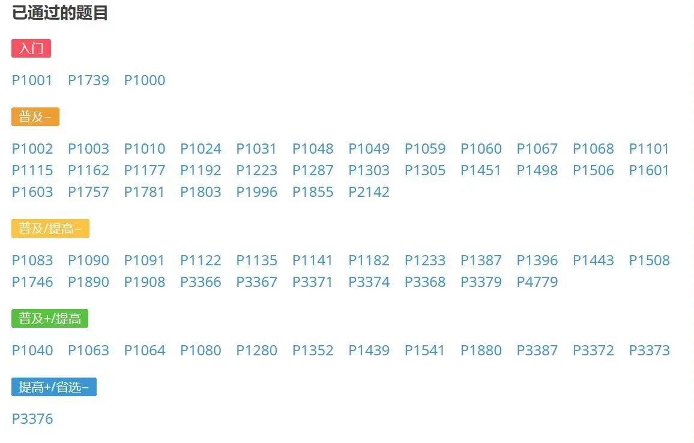

# AlgorithmPactice

> 参考资料：
> 洛谷 [https://www.luogu.com.cn/](https://www.luogu.com.cn/)
> OI Wiki: [https://oi-wiki.org/](https://oi-wiki.org/)

## 知识点

### 模拟（重点）

### 算法基础（重点）

* 贪心
* 递归
* 动态规划
* 排序
* 前缀和&差分
* 二分

### 字符串

* KMP算法
* 字符串哈希
* ~~字典树~~
* ~~AC自动机~~

### 搜索

* BFS
* DFS
* 层次遍历
* 记忆化剪枝

### 动态规划（专门挑出来）

* 背包问题
* 最优搜索树
* 矩阵乘法最优计算顺序
* 

### 数学

* 组合数
* 素数筛
* 高精度
* 高斯消元
* 牛顿迭代
* 卡特兰数

### 数据结构（重中之重）

* 树
    * 二叉树和森林（左儿子右兄弟）
    * 哈夫曼树
    * 最小生成树
* 并查集
* 堆
    * 建堆
    * 堆的过滤
    * 堆排序
* 栈
    * 栈的模拟
* 链表
    * 约瑟夫环
* 树状数组
* 单调栈、单调队列
* 最小公共祖先
* ~~线段树~~
* ~~左偏树~~
* ~~树上DP~~

### 图算法

* 图的遍历
* DAG拓扑排序
* 单源最短路 SPFA算法、Dijkstra算法
* 多源最短路
* 最大流最小割 Dinic算法
* ~~tarjan强连通算法~~